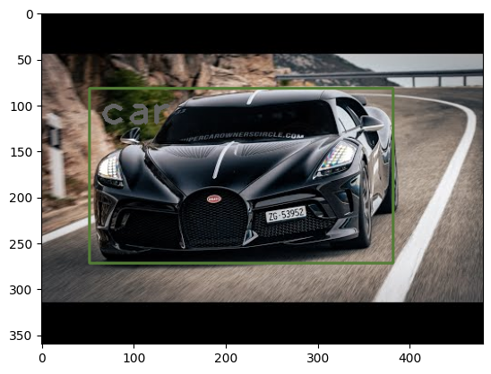

# Object-Detection
## Aim
To write a python program using OpenCV to perform object detection with label in an image.
## Software Required:
Anaconda - Python 3.7
## Algorithm:
### Step1:
Import necessary packages 
### Step2:
Set and add the config_file,weights to ur folder.
### Step3:
Use a pretrained Dnn model (MobileNet-SSD v3)
### Step4:
Create a classLabel and print the same
### Step5:
Display the image using imshow()
### Step6:
Set the model and Threshold to 0.5
### Step7:
Flatten the index,confidence.
### Step8:
Display the result.
## Program:
#### Sam Israeel D
#### 212222230128
```python
# In[2]:Import necessary packages 
import cv2
import matplotlib.pyplot as plt

# In[4]:Set and add the config_file,weights to ur folder.
config_file='ssd_mobilenet_v3_large_coco_2020_01_14.pbtxt'
frozen_model='frozen_inference_graph.pb'

# In[5]:Use a pretrained Dnn model (MobileNet-SSD v3)
model=cv2.dnn_DetectionModel(frozen_model,config_file)

# In[6]:Create a classLabel and print the same
classLabels = []
file_name='Labels.txt'
with open(file_name,'rt')as fpt:
    classLabels=fpt.read().rstrip('\n').split('\n')

# In[7]:Print the classLabels
print(classLabels)

# In[8]:
print(len(classLabels))

# In[9]:Display the image using imshow()
img=cv2.imread('download.jpeg')
plt.imshow(img)


# In[10]:
plt.imshow(cv2.cvtColor(img,cv2.COLOR_BGR2RGB))


# In[11]:Set the model and Threshold to 0.5
model.setInputSize(320,320)
model.setInputScale(1.0/127.5)#255/2=127.5
model.setInputMean((127.5,127.5,127.5))
model.setInputSwapRB(True)
ClassIndex,confidence,bbox=model.detect(img,confThreshold=0.5)
print(ClassIndex)


# In[29]:Flatten the index,confidence.
font_scale=3
font=cv2.FONT_HERSHEY_PLAIN
for ClassInd,conf,boxes in zip(ClassIndex.flatten(),confidence.flatten(),bbox):
    cv2.rectangle(img,boxes,(0,0,255),2)
    cv2.putText(img,classLabels[ClassInd-1],(boxes[0]+10,boxes[1]+40),font,fontScale=font_scale,color=(255,0,0),thickness=1)


# In[30]:Display the result.
plt.imshow(cv2.cvtColor(img,cv2.COLOR_BGR2RGB))
```
## Output


## Result:
Thus, a python program using OpenCV to perform object detection with label in an image is implemented successfully.
